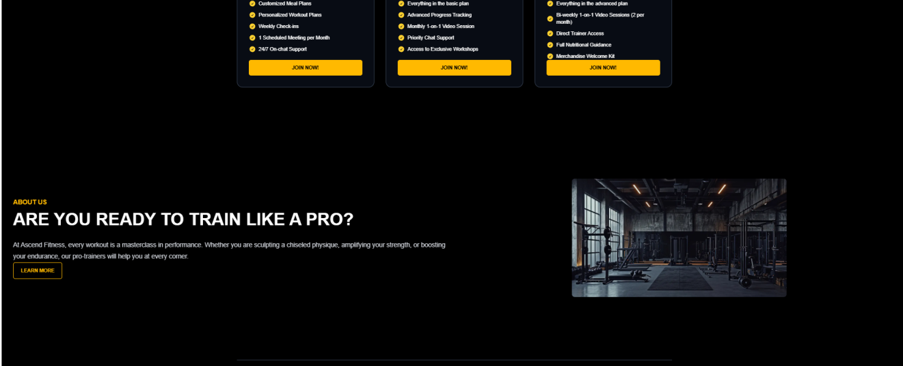
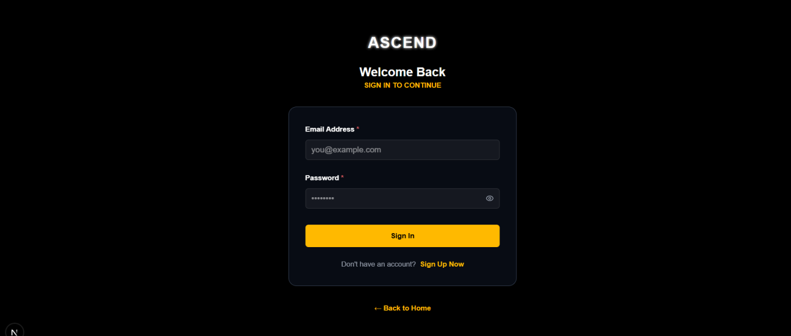
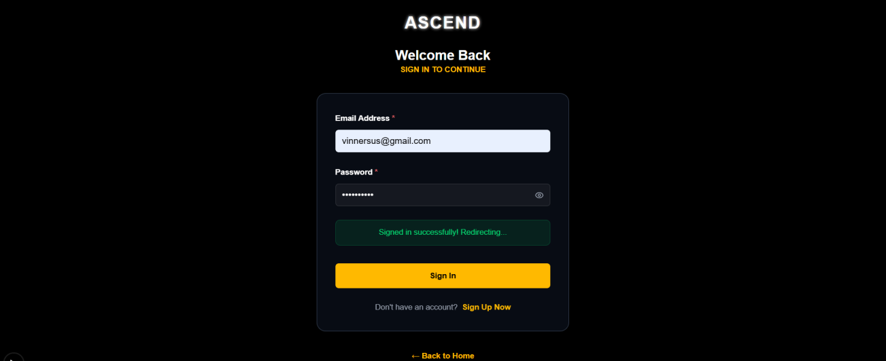
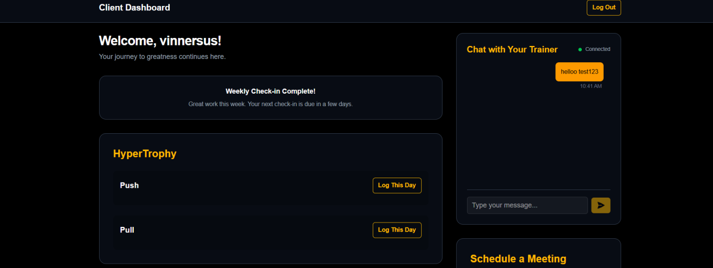
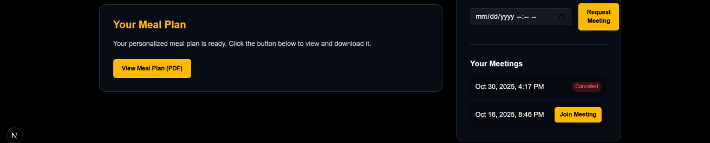
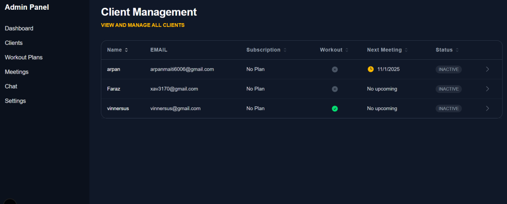
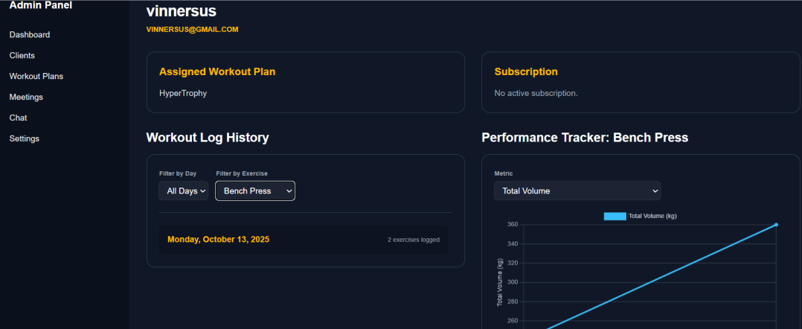
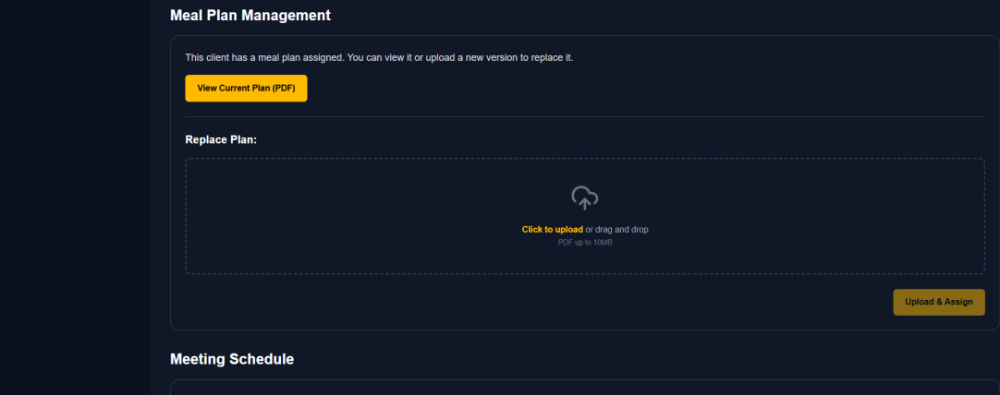
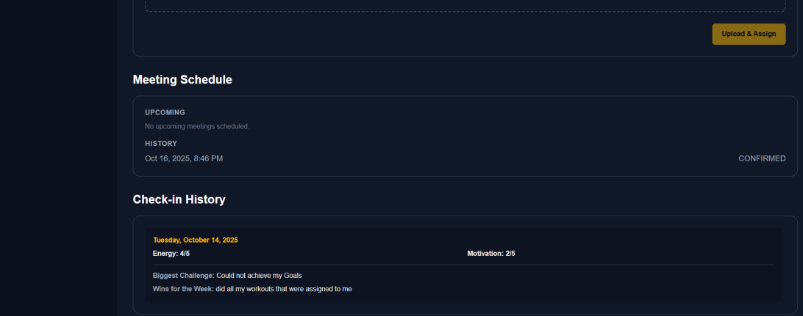
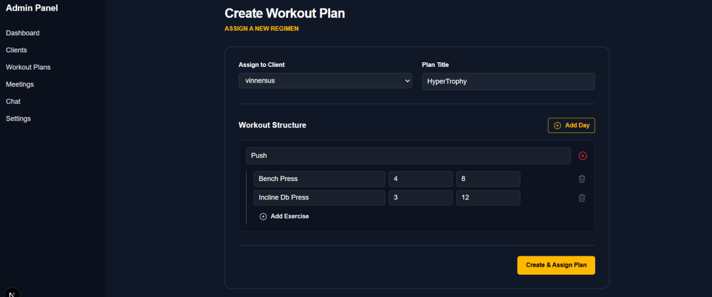

# 🏋️ Ascend Fitness Management System


A modern, full-stack SaaS-style fitness management platform built for personal trainers to manage their entire client lifecycle — replacing scattered spreadsheets, emails, and messaging apps with a single, cohesive ecosystem.

---

## 📸 Screenshots

### Home Page



### Login Page



### Client Dashboard



### Admin Panel


### Admin Client Detail — Workout Logs & Performance Charts




### Admin Workout Planner


---

## ✨ Features

### Client Dashboard
- View personalized workout and meal plans
- Log workout performance (sets, reps, weight) per exercise
- Real-time chat with trainer via Supabase Realtime
- Schedule meetings with Google Calendar integration
- Submit weekly check-ins (energy level, motivation, wins, challenges)

### Admin Panel
- Manage full client roster with subscription and workout status
- Create and assign dynamic workout plans with a visual planner
- Upload and assign PDF meal plans per client
- View client workout log history with filterable day and exercise views
- Track client progress with performance charts (E-1RM calculator built-in)
- Manage and confirm meeting requests
- Review weekly client check-in history

---

## 🛠 Tech Stack

| Layer | Technology |
|---|---|
| Framework | Next.js 14+ (App Router) |
| Language | TypeScript |
| Styling | Tailwind CSS |
| UI Components | Headless UI, Lucide React |
| Charts | Chart.js + react-chartjs-2 |
| Backend & Auth | Supabase (PostgreSQL, Auth, Storage, Realtime) |
| External API | Google Calendar API |
| Runtime | Node.js v18+ |

---

## 🗄 Database Schema

Built on PostgreSQL via Supabase with the following key tables:

| Table | Purpose |
|---|---|
| `profiles` | Stores all user data — role, stats, fitness goals, Google refresh token |
| `plans` | Subscription plan details — pricing, duration, meetings per month |
| `subscriptions` | Links clients to purchased plans with status and dates |
| `workout_plans` | Assigned workout routines stored as JSONB |
| `workout_logs` | Per-exercise performance logs — sets, reps, weight, notes |
| `weekly_checkins` | Subjective weekly feedback — energy, motivation, challenges, wins |
| `meetings` | Meeting requests and confirmations with Google Calendar links |
| `messages` | Real-time chat messages between trainer and clients |

---

## 🏗 Architecture

```
Client / Browser
      ↓
Next.js App Router (SSR + Client Components)
      ↓
Server Actions (secure server-side mutations)
      ↓
Supabase (PostgreSQL + Auth + Realtime + Storage)
      ↓
Google Calendar API (automated meeting scheduling)
```

**Key architectural decisions:**
- **Server Actions** used for all data mutations — no exposed API endpoints
- **Supabase Realtime** powers live chat with zero polling
- **Role-based access control** enforced at both UI and database (RLS) level
- **JSONB** used for flexible workout plan storage

---

## ⚙️ Getting Started

### Prerequisites
- Node.js v18+
- A Supabase project
- Google Calendar API credentials

### Installation

```bash
git clone https://github.com/Conceal34/personal-trainer-next.git
cd personal-trainer-next
npm install
```

### Environment Variables

Create a `.env.local` file:

```env
NEXT_PUBLIC_SUPABASE_URL=your_supabase_url
NEXT_PUBLIC_SUPABASE_ANON_KEY=your_supabase_anon_key
SUPABASE_SERVICE_ROLE_KEY=your_service_role_key
GOOGLE_CLIENT_ID=your_google_client_id
GOOGLE_CLIENT_SECRET=your_google_client_secret
```

### Run Locally

```bash
npm run dev
```

Open [http://localhost:3000](http://localhost:3000)

---

## 📁 Project Structure

```
ascend-fitness/
│
├── app/
│   ├── admin/                    # Admin panel pages
│   │   ├── clients/[clientId]/   # Client detail with logs & charts
│   │   ├── workouts/             # Workout planner
│   │   ├── meetings/             # Meeting management
│   │   └── chat/                 # Admin chat
│   ├── dashboard/
│   │   └── client/               # Client dashboard
│   │       └── actions.ts        # Server Actions (meeting, chat, workout log)
│   └── components/
│       ├── admin/                # Admin-specific components
│       └── ui/                   # Shared UI components
│
├── lib/
│   └── supabase/                 # Supabase client (server + client)
│
└── public/
    └── screenshots/              # App screenshots
```

---

## 🔮 Future Scope

- **Full Payment Integration** — Razorpay/Stripe checkout and webhook automation
- **Progress Photos** — Client body transformation photo tracking
- **Habit Tracking** — Daily checklist for water intake, sleep, supplements
- **Resource Library** — Exclusive content vault for clients (videos, PDFs, articles)
- **Dynamic Meal Plan Creator** — Form-based meal plan builder with macro tracking

---

## 👨‍💻 Author

**Vinner** — Full-Stack Engineer · IEEE Published Researcher  
MCA, Christ University, Delhi NCR

[](https://github.com/Conceal34)
[](mailto:vinnerhooda@gmail.com)
